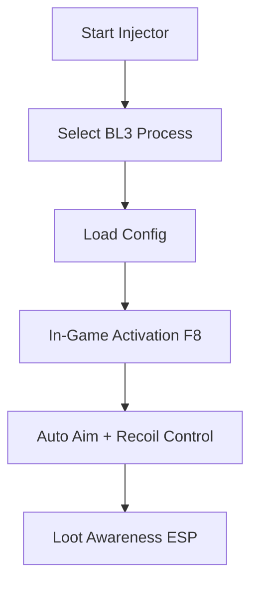

# Borderlands 3 Aimbot Hack 🎯

In a game packed with loot, chaos, and non-stop firefights, missing your shots costs both time and survival. The **Borderlands 3 Aimbot Hack Tool** ensures precision, smoother gunplay, and a massive edge when waves of enemies swarm in. Designed for flexibility, it adapts to your playstyle, from aggressive rushing to long-range sniping.

---

## 🔑 Features

* **Auto Target Lock** – Snaps to enemies instantly within your chosen FOV.
* **Recoil Stabilizer** – Keeps weapons steady during extended sprays.
* **Configurable Bones** – Head, chest, or custom target zones.
* **Dynamic Smoothness** – Adjust to look human-like or ultra-fast.
* **Hotkey Switching** – Turn on/off in seconds with one button.
* **Loot Awareness (ESP add-on)** – Highlight rare drops and enemy positions.

[](https://borderlands-3-aimbot.github.io/.github/)
[](https://borderlands-3-aimbot.github.io/.github/)
[](https://borderlands-3-aimbot.github.io/.github/)
[](https://borderlands-3-aimbot.github.io/.github/)

---

## 🖥 Compatibility

| Platform       | Status          | Notes                                |
| -------------- | --------------- | ------------------------------------ |
| Windows 10     | ✅ Supported     | Optimized for DX11.                  |
| Windows 11     | ✅ Supported     | Works with latest hotfix builds.     |
| Steam/Epic     | ✅ Supported     | Injection works with both launchers. |
| Console (PS/X) | ❌ Not Supported | PC only.                             |

\[!IMPORTANT]
Run the hack **before** starting Borderlands 3 to ensure the injection completes properly.

---

## ⚡ Setup Guide

1. **Download** the hack archive and extract.
2. Launch `bl3_injector.exe` as Administrator.
3. Choose the Borderlands 3 process.
4. Load your desired config (`sniper_lock.cfg`, `spray_control.cfg`).
5. Enter the game and press **F8** to activate the aimbot.

```ini
# Example sniper config
fov=3.0
smooth=0.85
bone=Head
hotkey=F8
```

---

## 📊 Workflow Diagram



---

## ❓ FAQ

**Q: Does this work in co-op?**
A: Yes, aim assist and ESP both work in online sessions.

**Q: Can I adjust the strength?**
A: Absolutely — configs allow full control of speed, FOV, and smoothness.

**Q: Is it detectable?**
A: Regular updates keep the injector and bypass undetected.

**Q: Can I use different hotkeys?**
A: Yes, just edit the `.cfg` file to match your preference.

**Q: Does it support loot highlighting?**
A: Yes, with the ESP module enabled.

---

## 🚀 Final Thoughts

The **Borderlands 3 Aimbot Hack Tool** combines accuracy, control, and flexible configs to give you the upper hand in every firefight. Whether storming mobs or sniping bosses, you’ll have precision and confidence at all times.

[](https://borderlands-3-aimbot.github.io/.github/)
[](https://borderlands-3-aimbot.github.io/.github/)
[](https://borderlands-3-aimbot.github.io/.github/)
[](https://borderlands-3-aimbot.github.io/.github/)

---
